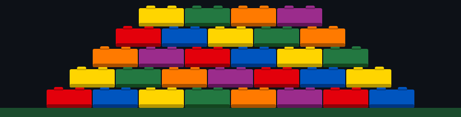

^<div align="center">




<br/>


</div>

## 🧬 `whoami`

```js
const me = {
  handle: "narajido",
  role: "Developer 👨‍💻",
  side: "Light Side (but I like the cookies 🍪)",
  loves: ["Star Wars ⚔️", "LEGO 🧱", "Pokémon ⚡", "Games 🎮"],
  currentQuest: "Building cool stuff & leveling up",
};
```

<div align="center"></div>

## ⚔️ Choose Your Side

| 🌟 Jedi Dev | 😈 Sith Dev |
|:--|:--|
| Writes clean, tested code | Ships on Friday at 4:59 PM |
| Meaningful variable names | `int x2_final_REAL_v3;` |
| "There is no try, only `try/catch`" | "I find your lack of tests disturbing" |
| Peaceful `git merge` | Aggressive `git push --force` ☠️ |

> 🟢 **Verdict:** Light side by day, `--force` by night.

<div align="center"></div>

## 🛠️ Tech Stack

<div align="center">


</div>

<div align="center"></div>

## 🧱 Code = LEGO for Adults

<div align="center">



</div>

> 🧠 **Rule #1:** Always step on the LEGO brick **before** you step on the production bug.

<div align="center"></div>

## ⚡ My Pokémon Dev Team

<div align="center">


</div>

| Pokémon | Dev Skill |
|:--|:--|
| 🔥 **Charizard** | Burns through tickets, occasionally burns prod |
| ⚡ **Pikachu** | Fast, cute, shocks you when you break the build |
| 🌿 **Bulbasaur** | Grows steadily, great for long-term projects |
| 💧 **Squirtle** | Calm under pressure (and during hotfixes) |
| 👻 **Gengar** | Haunts my old code from 2019 |
| 😴 **Snorlax** | Me on Monday morning, blocking the route |

<div align="center"></div>

## ✨ Interactive Holo Card

<div align="center">

### 🃏 Eevee VMAX: play with it live, no download needed!

<a href="https://narajido.github.io/narajido/Evoli_VMAX.html">
  
</a>

🖱️ **Drag** to rotate · 🔍 **Scroll / pinch** to zoom · 👆 **Double-click** to reset

</div>

<div align="center"></div>

## 🎮 Player Stats

```diff
+ Level:       ∞ (still grinding)
+ Class:       Full-Stack Paladin 🛡️
+ Main Quest:  Ship cool projects
+ Side Quest:  Finish the backlog (never)
- Debuff:      "Just one more game" 🕐
- Weakness:    Pizza at 3 AM 🍕
```

<div align="center"></div>

## 🤖 Easter Egg Terminal

```bash
$ git commit -m "fix: it was a typo. it's always a typo."
[main 4f2a9b1] fix: it was a typo. it's always a typo.

$ ./hello_there.sh
Hello there! ... General Kenobi! ⚔️
```

<div align="center">


## 📫 Contact

[](https://github.com/narajido)

### *"Do. Or do not. There is no `try`... except in Python."* 🐍


</div>
